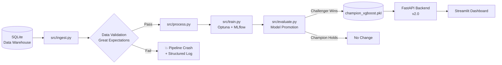

# Credit Risk Intelligence System — MLOps Pipeline


---

## Overview

A **production-grade, continuously-learning credit risk assessment system** built on the Kaggle *Give Me Some Credit* dataset.

This project goes well beyond standard ML notebooks. It implements a complete MLOps architecture: automated data ingestion from a SQL warehouse, zero-leakage feature engineering, Optuna hyperparameter optimization with full MLflow experiment tracking, automated model promotion, and a live Streamlit dashboard with SHAP-based explainability — all orchestrated by a GitHub Actions CI/CD pipeline.

**Live Demo:** `[Insert Render URL here]`  
**Kaggle Score:** Private Leaderboard ROC-AUC **0.8697**

---

## Pipeline Architecture



---

## Project Structure

```
credit_risk_system_mlops/
│
├── app/                          # FastAPI backend
│   ├── __init__.py
│   ├── main.py                   # API endpoints (v2.0 — routes through master_pipeline)
│   ├── engine.py                 # InferenceEngine: preprocessing + XGBoost + SHAP
│   ├── preprocessor.py           # Legacy (superseded by master_pipeline.pkl)
│   ├── schemas.py                # Pydantic request/response models
│   └── custom_transformers.py    # CreditRiskFeatureEngineer (zero-leakage, 3 hotfixes)
│
├── src/                          # MLOps pipeline scripts
│   ├── __init__.py
│   ├── ingest.py                 # Stage 1: SQL batch fetch + data validation
│   ├── process.py                # Stage 2: Feature engineering + pipeline persistence
│   ├── train.py                  # Stage 3: Optuna hyperparameter search + MLflow logging
│   └── evaluate.py               # Stage 4: Champion vs. challenger + auto-promotion
│
├── config/
│   └── config.yaml               # Single source of truth (paths, thresholds, MLflow settings)
│
├── tests/
│   └── test_transformer.py       # 5 pytest cases for CreditRiskFeatureEngineer
│
├── notebooks/
│   ├── archive/                  # Original unedited notebooks
│   ├── v1_basic/                 # Introductory sklearn pipeline notebooks
│   └── v2_production/            # Advanced MLOps notebooks (source of truth for pipeline)
│       ├── 01_data_cleaning_advanced.ipynb
│       └── 02_model_training_advanced.ipynb
│
├── models/
│   ├── master_pipeline.pkl        # Fitted preprocessing pipeline (zero-leakage)
│   └── champion_xgboost.pkl      # Best Optuna-tuned XGBoost model (served by API)
│
├── data/
│   ├── GiveMeSomeCredit/         # Raw Kaggle CSV files
│   ├── credit_warehouse.db       # SQLite mock Data Warehouse
│   ├── raw_batch.csv             # Latest ingested batch (ingest.py output)
│   └── processed/                # Processed train/test splits (process.py output)
│
├── .github/workflows/
│   └── ml_pipeline.yml           # GitHub Actions: weekly retraining cron
│
├── Makefile                      # Developer shortcuts (make pipeline, make test, etc.)
├── docker-compose.yml            # Multi-container: FastAPI backend + Streamlit frontend
├── Dockerfile.backend
├── Dockerfile.frontend
├── requirements.txt
└── README.md
```

---

## Quickstart

### Run the Full MLOps Pipeline

```bash
# Run all 4 pipeline stages sequentially
make pipeline

# Or run individual stages
make ingest    # Fetch & validate new borrower data from SQLite
make process   # Feature engineering + save master_pipeline.pkl
make train     # Optuna tuning (50 trials) + MLflow logging
make promote   # Compare models; promote challenger if it wins
```

### Run the Streamlit Dashboard

```bash
docker-compose up --build
```

| Service    | URL                          |
|------------|------------------------------|
| Frontend   | http://localhost:8501        |
| Backend API| http://localhost:8000/docs   |

### Run Tests

```bash
make test
# or
pytest tests/ -v
```

### View Experiment History in MLflow

```bash
make mlflow
# Opens MLflow UI at http://localhost:5000
```

---

## Key Technical Decisions

### Why SQLite Instead of a Raw CSV for Ingestion?
The `src/ingest.py` script pulls data via SQL query from a local SQLite database acting as a mock Data Warehouse. This mimics real incremental loading from Snowflake/Redshift using a `processed` watermark column — the same pattern used by data engineers at scale. Records fetched are immediately marked `processed=1` to prevent double-ingestion across pipeline runs.

### Why IterativeImputer Instead of Median Imputation?
`IterativeImputer` (MICE — Multiple Imputation by Chained Equations) models each feature as a function of all other features using Ridge regression. For correlated financial variables like `MonthlyIncome` and `DebtRatio`, this captures relationships that naive median imputation ignores.

### Why Optuna Instead of GridSearchCV?
Optuna uses a Tree-structured Parzen Estimator (TPE) — a Bayesian algorithm that intelligently narrows the search space based on prior trial outcomes. It converges to an optimal configuration with far fewer evaluations than grid or random search.

### Why MLflow Instead of Just Printing Scores?
MLflow provides a persistent, queryable record of every training run — hyperparameters, metrics, and model artifacts. Without it, you can't answer "was last week's model better than today's?" or replay an experiment from 3 months ago.

### Why Automated Model Promotion?
`src/evaluate.py` compares the newly trained challenger against the current production champion on the same held-out test set. If the challenger wins, it automatically overwrites `models/champion_xgboost.pkl` — the exact file the FastAPI backend loads on startup. This closes the loop from training to production with zero manual steps.

---

## Performance

| Metric         | Score  |
|----------------|--------|
| ROC-AUC (CV)   | 0.8697 |
| Kaggle Private | 0.8675 |
| Approval Threshold | 30% default probability |

---

## Tech Stack

| Layer | Technology |
|---|---|
| API Backend | FastAPI |
| Frontend | Streamlit |
| ML Model | XGBoost (Optuna-optimized) |
| Preprocessing | Scikit-Learn Pipeline + IterativeImputer |
| Explainability | SHAP TreeExplainer |
| Experiment Tracking | MLflow |
| Data Validation | Custom Great Expectations suite |
| Data Warehouse | SQLite (mock) |
| Orchestration | GitHub Actions (weekly cron) |
| Containerization | Docker + Docker Compose |

---

## License

MIT License — Omar F. | Applied Machine Learning Portfolio | Cairo, Egypt
